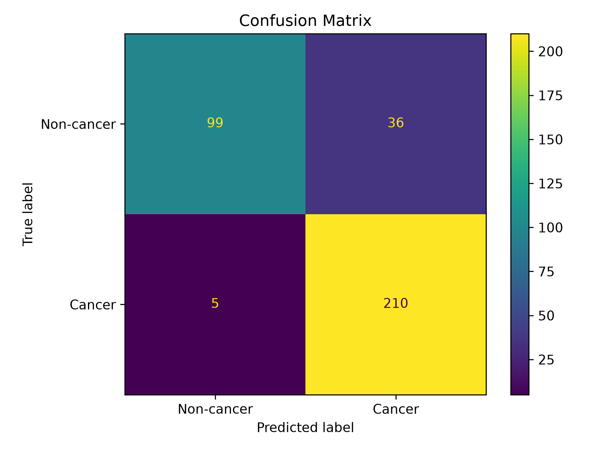
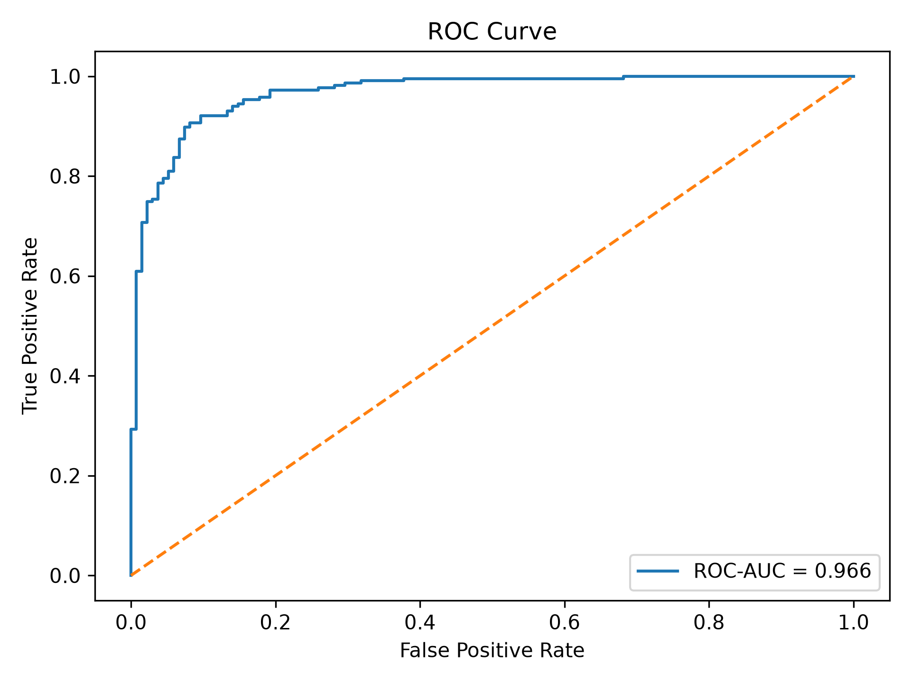
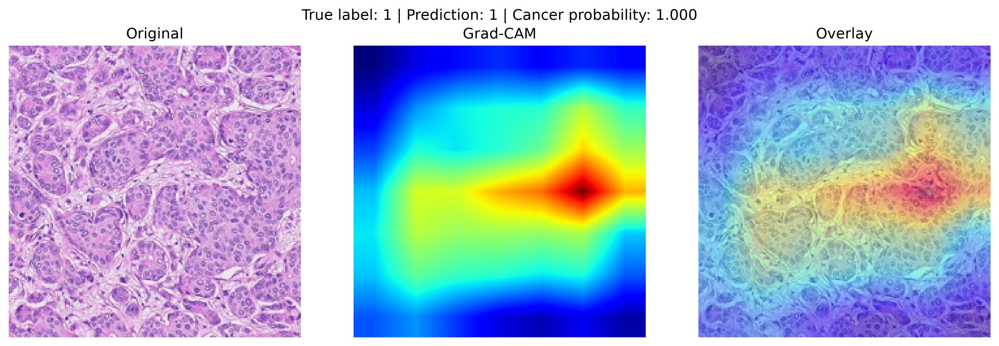
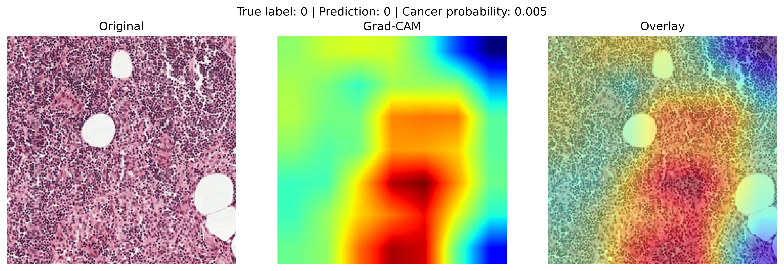
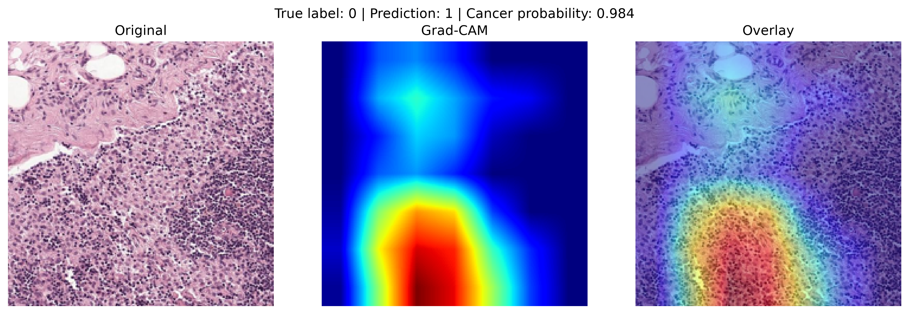
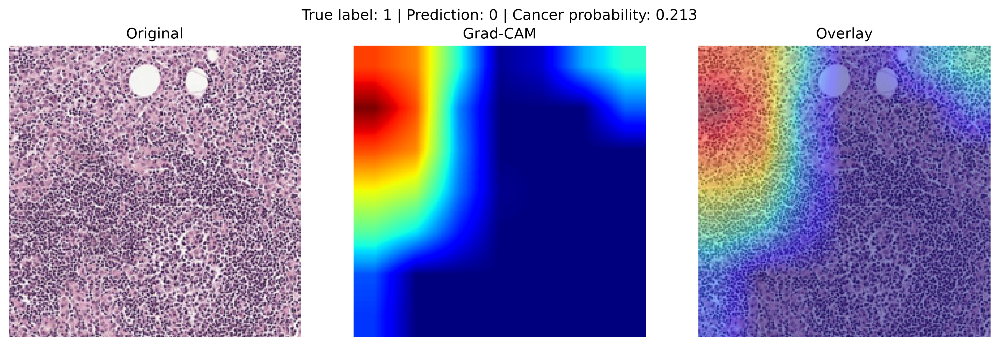

# Histopathology Cancer Detection with ResNet-18 & Grad-CAM

[](https://github.com/ardaatikk/histopathology-cancer-detection/actions/workflows/tests.yml)
[](https://www.python.org/)
[](LICENSE)

Deep learning pipeline for detecting **breast cancer metastasis in lymph node histopathology images** using **transfer learning with an ImageNet-pretrained ResNet-18**, with quantitative evaluation and Grad-CAM explainability.

The project covers the complete workflow from image preprocessing and model training to validation, test inference, quantitative evaluation, and visual interpretation of model predictions.

> **Note:** This project was developed for research and educational purposes and is not intended for clinical diagnosis or medical decision-making.

---

## Overview

Cancer diagnosis from histopathology images is a challenging computer vision problem where subtle tissue patterns may distinguish cancerous from non-cancerous samples.

This project implements an end-to-end deep learning workflow for binary classification of histopathology images.

The pipeline includes:

- ResNet-18 based image classification
- Dataset preprocessing and normalization
- Training and validation pipelines
- Test-set probability prediction
- Accuracy, precision, recall, F1 and ROC-AUC evaluation
- Confusion matrix and ROC curve generation
- Grad-CAM based model explainability
- Grad-CAM analysis for arbitrary input images
- Reproducible utility scripts for dataset preparation and visualization

---

## Model Performance

The trained model was evaluated on a held-out validation set containing **350 images**.

| Metric | Score |
|---|---:|
| Accuracy | **88.29%** |
| Precision | **85.37%** |
| Recall / Sensitivity | **97.67%** |
| F1 Score | **91.11%** |
| ROC-AUC | **96.63%** |

The high recall indicates that the model identified most positive samples in this validation split. However, these results should be interpreted in the context of the dataset and should not be treated as evidence of clinical performance.

---

## Evaluation Results

### Confusion Matrix

<p align="center">
  
</p>

### ROC Curve

<p align="center">
  
</p>

The ROC-AUC of **0.9663** indicates strong class-separation performance on the held-out validation data.

---

## Explainability with Grad-CAM

To provide insight into the spatial regions contributing to model predictions, the project includes **Gradient-weighted Class Activation Mapping (Grad-CAM)**.

Rather than treating the classifier as a complete black box, Grad-CAM visualizes regions that contribute strongly to a selected model output.

The validation pipeline automatically generates examples from four prediction categories:

| True Positive | True Negative |
|---|---|
|  |  |

| False Positive | False Negative |
|---|---|
|  |  |

Including both correct and incorrect predictions helps inspect not only successful model behavior but also failure cases.

> Grad-CAM highlights regions that influence model activations. It does **not** establish that a highlighted region is clinically cancerous or provide a medical explanation by itself.

---

## Single-Image Grad-CAM Analysis

Grad-CAM can also be generated for an individual histopathology image.

```bash
python src/gradcam.py --image path/to/image.jpeg
```

The script outputs:

- predicted class
- cancer probability
- original image
- Grad-CAM heatmap
- heatmap overlay

Generated single-image visualizations are saved under:

```text
outputs/gradcam/
```

This makes it possible to inspect the model's behavior on additional compatible images without modifying the validation dataset.

---

## Dataset

This project uses histopathology image samples derived from the **CAMELYON17 dataset**, a publicly available dataset for the detection of breast cancer metastases in lymph node tissue.

The dataset used in this repository consists of **2,337 histopathology image samples** prepared from the source data and divided into three subsets:

| Split | Images | Purpose |
|---|---:|---|
| Training | 1,049 | Model optimization |
| Validation | 350 | Model evaluation |
| Test | 938 | Unlabeled inference |
| **Total** | **2,337** | |

The validation set contains:

- **135 non-cancer samples**
- **215 cancer samples**

The training, validation and test annotations are stored under `data/`.

> The 2,337 images in this repository represent the subset prepared for this project and should not be interpreted as the full CAMELYON17 dataset.

---

## Image Preprocessing

Images are resized to:

```text
224 × 224
```

Dataset-level RGB statistics are used for normalization.

```python
mean = (0.62376275, 0.43274997, 0.64434578)
std  = (0.22018620, 0.23024299, 0.19410873)
```

These statistics were calculated across all **2,337 images** using:

```bash
python scripts/calculate_rgb_stats.py
```

---

## Model Architecture

The classifier is based on **ResNet-18** and uses a transfer learning approach.

The network is initialized with **ImageNet-pretrained weights**, the original ImageNet classification layer is removed, and a custom binary classification head is added for breast cancer metastasis detection.

During training, the ResNet-18 backbone is **fine-tuned end-to-end** together with the custom classification head rather than being kept frozen.

Conceptually:

```text
Histopathology Image
        │
        ▼
 Resize + Normalize
        │
        ▼
ImageNet-pretrained ResNet-18
        │
        ▼
 End-to-End Fine-Tuning
        │
        ▼
 512-d Feature Vector
        │
        ▼
 Linear (512 → 128) + ReLU
        │
        ▼
   Linear (128 → 2)
        │
        ▼
Cancer / Non-cancer
```

The model produces two logits corresponding to the binary classes.

For inference, softmax probabilities are calculated and the probability associated with the cancer class is exported as `cancer_score`.

---

## Project Structure

```text
histopathology-cancer-detection/
│
├── .github/
│   └── workflows/
│       └── tests.yml
│
├── assets/
│   ├── confusion_matrix.png
│   ├── metrics.txt
│   ├── roc_curve.png
│   └── gradcam/
│       ├── true_positive.png
│       ├── true_negative.png
│       ├── false_positive.png
│       └── false_negative.png
│
├── checkpoints/
│   └── weights_epoch_100.pt
│
├── data/
│   ├── train.csv
│   ├── validation.csv
│   └── test.csv
│
├── images/
│
├── scripts/
│   ├── calculate_rgb_stats.py
│   ├── plot_training.py
│   └── split_dataset.py
│
├── src/
│   ├── dataset.py
│   ├── dataset_inference.py
│   ├── evaluate.py
│   ├── gradcam.py
│   ├── inference.py
│   ├── model.py
│   └── train.py
│
├── tests/
│   ├── test_dataset.py
│   ├── test_inference.py
│   ├── test_model.py
│   ├── test_gradcam.py
│
├── .gitignore
├── LICENSE
├── README.md
├── requirements.txt
└── requirements-dev.txt
```

Generated predictions, training logs, plots and single-image Grad-CAM outputs are stored under `outputs/` and excluded from version control.

---

## Installation

Clone the repository:

```bash
git clone https://github.com/ardaatikk/histopathology-cancer-detection.git
cd histopathology-cancer-detection
```

Creating a virtual environment is recommended:

```bash
python -m venv .venv
source .venv/bin/activate
```

On Windows:

```bash
.venv\Scripts\activate
```

Install the dependencies:

```bash
pip install -r requirements.txt
```

---

## Training

Train the model with:

```bash
python src/train.py
```

The default configuration uses:

```text
Learning rate: 0.001
Batch size:    16
Epochs:        20
Momentum:      0.9
```

Training parameters can be overridden from the command line:

```bash
python src/train.py \
  --learning_rate 0.001 \
  --batch_size 16 \
  --num_epochs 20 \
  --momentum 0.9
```

Training logs are written to:

```text
outputs/training/
```

Checkpoints are written to:

```text
checkpoints/
```

The training pipeline also keeps the checkpoint corresponding to the lowest observed validation loss.

---

## Evaluation

Evaluate the provided trained checkpoint with:

```bash
python src/evaluate.py
```

The script calculates:

- Accuracy
- Precision
- Recall
- F1 Score
- ROC-AUC
- Confusion matrix
- ROC curve

Evaluation artifacts are written to `assets/`.

---

## Test Inference

Run inference on the test split:

```bash
python src/inference.py
```

The resulting CSV is saved under:

```text
outputs/predictions__weights_epoch_100.csv
```

with the structure:

```text
img_id,cancer_score
slide_...,0.4092
slide_...,0.9955
...
```

The provided test split contains **938 images**.

---

## Grad-CAM Validation Examples

Generate True Positive, True Negative, False Positive and False Negative Grad-CAM examples with:

```bash
python src/gradcam.py
```

The resulting visualizations are written to:

```text
assets/gradcam/
```

For a specific image:

```bash
python src/gradcam.py --image path/to/image.jpeg
```

Single-image outputs are instead written to:

```text
outputs/gradcam/
```

---

## Utility Scripts

### Calculate dataset RGB statistics

```bash
python scripts/calculate_rgb_stats.py
```

### Plot training history

```bash
python scripts/plot_training.py \
  --log_file outputs/training/training_TIMESTAMP.csv
```

Generated plots are saved under:

```text
outputs/plots/
```

### Create a train/validation split

```bash
python scripts/split_dataset.py \
  --data_file path/to/labeled_dataset.csv
```

The splitting utility supports deterministic, stratified splitting through a configurable random seed and validation ratio.

---

## Limitations

This project has several important limitations:

- Evaluation is performed on the provided dataset and does not establish external clinical validity.
- The validation set is relatively small and class-imbalanced.
- Performance may change substantially on images produced using different scanners, staining protocols, tissue preparation procedures or data distributions.
- Grad-CAM provides a visualization of model activation patterns, not a clinical explanation.
- The model has not been validated prospectively or in a clinical environment.
- Reported metrics should therefore be interpreted as experimental machine-learning results rather than diagnostic performance.

---

## Testing

The repository includes automated tests covering the core data, model, inference, and Grad-CAM functionality.

The current test suite contains **16 tests** covering:

- training and inference dataset behavior
- preprocessing transforms
- ResNet-18 model construction
- classifier output dimensions
- model forward passes
- checkpoint loading
- inference CSV generation
- preservation of image identifiers
- Grad-CAM heatmap generation
- Grad-CAM normalization
- Grad-CAM activation and gradient hooks

Run the complete test suite with:

```bash
python -m pytest -v
```

## Reproducibility

The repository includes:

- training and validation annotations
- test annotations
- preprocessing statistics
- model checkpoint
- evaluation code
- inference code
- explainability code
- dataset preparation utilities

This allows the main evaluation and inference workflow to be reproduced from the repository.

---

## Dataset Source

This project uses image samples derived from the **CAMELYON17 (CAMelyon17) dataset**, a public histopathology dataset developed for the automated detection and classification of breast cancer metastases in hematoxylin and eosin (H&E) stained lymph node sections.

The original CAMELYON17 dataset contains whole-slide images collected from five medical centers in the Netherlands. The 2,337 images used in this repository represent the subset prepared for this project and should not be interpreted as the complete CAMELYON17 dataset.

### References

- [CAMELYON17 Grand Challenge](https://camelyon17.grand-challenge.org/) — official dataset and challenge documentation
- Bandi, P. et al. *From Detection of Individual Metastases to Classification of Lymph Node Status at the Patient Level: The CAMELYON17 Challenge.* IEEE Transactions on Medical Imaging. DOI: 10.1109/TMI.2018.2867350
- Litjens, G. et al. *1399 H&E-stained sentinel lymph node sections of breast cancer patients: the CAMELYON dataset.* GigaScience. DOI: 10.1093/gigascience/giy065

---

## Technologies

- Python
- PyTorch
- Torchvision
- ResNet-18
- NumPy
- Pandas
- Scikit-learn
- Matplotlib
- Pillow
- Grad-CAM

---

## Disclaimer

This repository is a **research and educational machine-learning project**.

It is **not a medical device**, has not been clinically validated, and must not be used to diagnose cancer or make medical decisions.

---

## Author

**Arda Atik**

Artificial Intelligence Engineer

- GitHub: [@ardaatikk](https://github.com/ardaatikk)